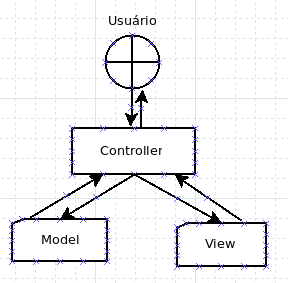

# phpoo-livro

Livro de introdução ao PHP orientado a objetos usando MVC com rotas.

Porque de forma prática, por conta da criação, passo a passo, de um aplicativo em PHP orientado a objetos usando MVC e rotas.

Aqui quero deixar minha gratidão ao Cris, autor do excelente aplicativo

https://github.com/panique/mini3

Que por cotna da sua clareza me permitiu entender como se cria um bom aplicativo em PHP usando MVC.

## Dica extra

Ao pesquisar projetos por php mvc ou framework mvc do zero, acontece muito de ao invés de usar o nome Route ou Router para a classe de rotas, o autor usar App ou Application. Alguns até recomendam por ser mais semântico e combinar melhor com sua função.

## Atualizações - [visite para ver as últimas](atualizacoes)

## Índice do Livro

[indice.pdf](indice.pdf)

## Livro

[phpoo.pdf](phpoo.pdf)

## Material de apois

Na pasta Repositório

- Aplicativos
    - [app-php-mvc](Repositorio/Aplicativos/app-php-mvc) (3 versões do aplicativo criado no livro)
    - app_phpoo
    
- BoasPraticas
- Classes
- ClassesUteis
- NameSpace
- Padroes
- PHPModerno
- Tutoriais

## Diagrama MVC

### Fluxo de informações do MVC

- Um usuário faz uma requisição (digitando uma URL no navegador, clicando num link, etc)
- A requisição é recebida pelo Front Controller (public/index em nosso caso)
- Front controller envia para o Router (Core/Router)
- Router envia para o requisitado controller/action
- O controller/action solicita as informações do model/method
- Model/method solicita ao Database
- Database devolve para o model/method
- Model/method devolve para o controller/action
- Controller/action devolve para a respectiva view
- Assim chega ao usuário

## Sugestões

Serão bem vindas. Use o forum para isso - [https://github.com/ribafs/phpoo-livro/discussions](https://github.com/ribafs/phpoo-livro/discussions)

## Licença

MIT
